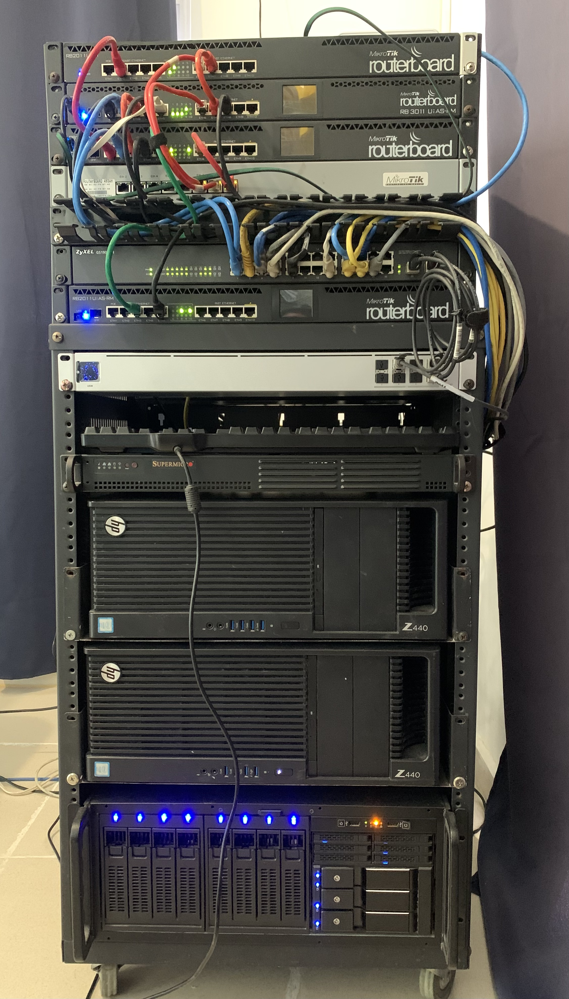

### Ariel Antigua Networks - (aaNetworks)
[aaNetworks](https://aanetworks.org)
### homelab infrastructura.

### Iniciemos con el hardware.

networking:

    En esta sección tenemos varios routers y switches.

        -   WAN1 – este es el equipo que la mayoría tenemos en casa, es asignado por CLARO para los clientes con Fibra Óptica, mi velocidad de internet actual es 300Mbps/75Mbps.
        -   WAN2 – Internet de Orbit Cable, entregado vía Fibra Óptica. Solo tiene 10Mbps/5Mbps, lamentablemente esta detrás de CGNAT.
        -   firewall01 - Peplink Balance 20X
        -   firewall02 – Sophos XG 115 corriendo opnSense 27
        -   nixon – Mikrotik RB3011-RM – este equipo forma parte de una nube MPLS y es un router de borde.
        -   zapp – Mikrotik RB2011-RM – este es el route principal de la red.
        -   lrrr –   Mikrotik RB493AH – router para pruebas de PPPoE, MPLS y VPLS.
        -   brrr –  Mikrotik RB750Gr3 – router para pruebas de PPPoE, MPLS y VPLS.
        -   ndnd – Mikrotik RB2011L-RM – router para pruebas de PPPoE, MPLS y VPLS.
        -   elzar – Mikrotik RB2011-RM – router para pruebas de PPPoE, MPLS y VPLS.
        -   CORE01 – Zyxel GS-1900 – Switch principal de la red.
        -   CORE02 - Ubiquiti Aggreation - 10Gbe switch for vSAN/vMotion and Data Traffic
        -   Atlas1 – RIPE Atlas sensor (Probe #28779) – este equipo directamente no se controla, es parte del proyecto Atlas de RIPE NCC. (¡¡¡4 anos en funcionamiento !!!)
        -   Atlas2 – RIPE Atlas Sensor (Probe #51981) – este sensor reporta estadísticas usando el internet de CLARO.
        -   Atlas3 – RIPE Atlas Sensor (Probe #32174) – este sensor reporta estadísticas usando el internet de ORBIT.
        -   Ubiquiti UCK – Generación 1 cloud key.

servers:

    Supermicro decomisionado.

        -   Intel(R) Atom(TM) CPU D2500 @ 1.86GHz
        -   6GB de RAM
        -   SSD 60GB Sandisk
        -   2x 1Gb NIC

    2x HP Z440 - (Proxmox VE 8.1)

        -	Intel Xeon E5-2640 v4
        -	128GB of DDR4
        -	1 Samsung SSD 970 EVO 1TB
        -	1 Kingston SSD 240G (ESXi installed here)
        -	1 Intel SSD DC S3700 1.6TB
        -	1 10Gb Dual port SFP+ HP NC560

    store – unRAID 6 – almacenamiento centralizado para las necesidades de File Services. Además de storage con unRAID se tiene la facilidad de correr Docker/VM. Alguno de los contenedores corriendo aquí son Plex, Syncthing, Sonarr, Radarr y algún otro que olvide ahora mismo.

        -   Ahora es una VM (Proxmox VE 8.1)
        -   Supermicro X9SRL
        -   Intel Xeon E5-2680 v2
        -   128GB de RAM
        -   2x 2TB Hard disks
        -   2x 4TB Hard disks
        -   2x 3TB Hard disks
        -   1x Intel SSD PCIe 1.6 TB
        -   More SSDs for VMs….
        -   2x 1Gb NIC
        -   1 10Gb Dual port SFP+ HP NC560
        -   Rosewill RSV-L4000 – 4U

Equipos que no estan en el rack.

    2x HP Proliant EC200a

        -   Intel(R) Xeon(R) CPU D-1518 @ 2.20GHz
        -   64GB de RAM
        -   1x SSD 240GB
        -   1 Intel SSD DC S3700 1.6TB
        -   1x M.2 NVMe 500GB

